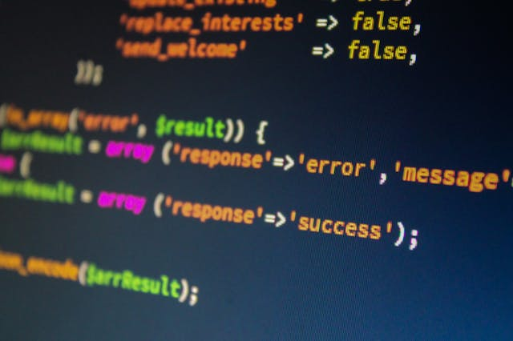

# Symfony projekt



## Beskrivning

Detta är mitt Symfony-projekt som jag utvecklar för kursen MVC i BTH

## Hur man kommer igång

För att börja använda och bidra till projektet, följ stegen nedan:

### Kloning av repository

Använd `git clone` för att klona det här projektet till din lokala maskin:

```bash
git clone https://github.com/rebahama/bth-mvc-1

cd projektnamn/app

composer install

För att starta projeket på lokala maskinen skriv in:
php -S localhost:8888 -t public
